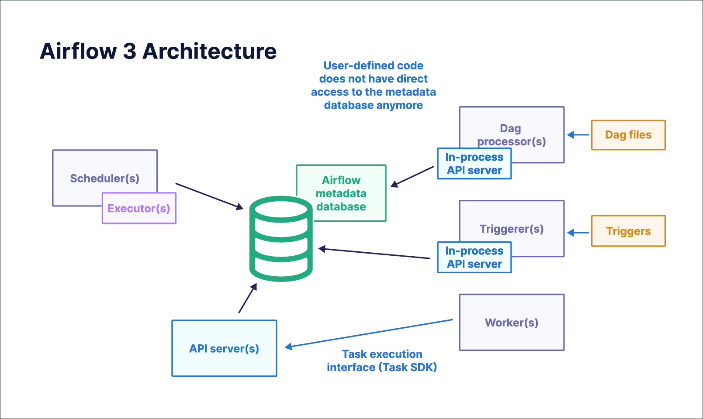

# Kiến trúc Apache Airflow cơ bản



- **Scheduler**:
  - Là trái tim của Airflow, quản lý toàn bộ tasks và Dags và lên lịch cho các nhiệm vụ thất bại một cách sớm nhất
  - Khi chạy một DAG, Scheduler luôn lấy phiên bản mới nhất của DAG đó.
- **API server**: FastAPI server cung cấp UI và 3 API chính cho Airflow:
  - Một API cho workers khi chạy một task
  - Một Internal API cho Airflow UI cung cấp khả năng cập nhật động các trạng thái của DAGs và tasks
  - Một public API cho phép người dùng tương tác với Airflow https://airflow.apache.org/docs/apache-airflow/stable/stable-rest-api-ref.html
- **Dag processor**
  - Chịu trách nhiệm cho việc nhận và phân tích file DAGs từ thư mục được cấu hình
- **Meta database**:
  - Lưu trữ thông tin thiết yếu về Airlow, như connections, serialized DAGs, và các XCOM information.
  - Lưu trữ lịch sử chạy DAG và nhiệm vụ bao gồm trạng thái
  - PostgreSQL là lựa chọn phổ biến nhất cho Meta database, nhưng Airflow cũng hỗ trợ SQLite và MySQL.
- **Triggerer**:
  - là một đoạn mã Python nhỏ, bất đồng bộ (asynchronous), chạy trong tiến trình riêng biệt
  - Khi một task cần chờ đợi một sự kiện, triggerer sẽ được kích hoạt để theo dõi sự kiện đó và thông báo khi sự kiện xảy ra.
  - Ví dụ: nếu một task cần chờ đợi một file được tải lên, triggerer sẽ theo dõi thư mục và thông báo khi file đó xuất hiện.
  - Bạn cần chờ bạn mình mang đồ ăn tới. Thay vì cứ ngồi ở cửa đợi (tốn thời gian), bạn nhờ người gác cổng (trigger) đứng đó. Khi đồ ăn tới, người gác cổng gọi bạn ra nhận. Trong lúc chờ, bạn có thể làm việc khác.

## Đây là những bước xảy ra khi thêm một DAG mới vào Airflow:
1. DAG được phân tích bởi Dag Processor, lưu trữ một phiên bản tuần tự hóa (tức là DAG được chuyển đổi thành một định dạng có thể lưu trữ) vào Meta Database.
2. Scheduler kiểm tra bản DAG được tuần tự hóa này đẻ xác định xem có đủ điều kiện để thực thi theo lịch trình đã xác định hay không. 
3. Khi DAG được xác định là đủ điều kiện, Scheduler sẽ cấu hình executor để quyết định cách mà task đầu tiên sẽ được thực hiện.
4. Các task tiếp theo được lên lịch trong một hàng đợi. Các workers sẽ lấy từ queue cho các nhiệm vụ nó có thể thực hiện được
5. Worker khi lấy task và chạy task đó, các thông tin về trạng thái hay XCOM sẽ được gửi về meta database thông qua API server. Nếu task cần thêm các thông tin, như là các Connections, thì worker sẽ gửi yêu cầu tới API server để lấy thông tin. Trong quá trình task chạy, worker sẽ ghi các log trực tiếp vào nơi lưu trữ logs đã được cấu hình.
6. Scheduler cần những trạng thái của task trong DAG để quyết định các task tiếp theo có thể được chạy.

## Viết DAG đầu tiên
**Import modules cần thiết**

```python
from airflow.sdk import DAG, dag, task
from airflow.providers.standard.operators.bash import BashOperator
from airflow.providers.standard.operators.python import PythonOperator
from datetime import datetime, timedelta
```

**Định nghĩa default_args**
```python
default_args = {
    'owner': 'data_engineer',
    'depends_on_past': False,
    'start_date': datetime(2024, 1, 1),
    'email_on_failure': False,
    'email_on_retry': False,
    'retries': 1,
    'retry_delay': timedelta(minutes=5)
}
```

**Ví dụ DAG đơn giản**

```python
with DAG(
    'my_first_dag',
    default_args=default_args,
    description='DAG đầu tiên để học Airflow',
    schedule=timedelta(days=1),  # Chạy hàng ngày
    start_date=datetime(2024, 1, 1),
    catchup=False,  # Không chạy lại các lần bỏ lỡ
    tags=['tutorial', 'beginner']
) as dag:
    # Tasks sẽ được định nghĩa ở đây
    pass
```

Schedule (Lập lịch)
- schedule='@daily' - Chạy hàng ngày
- schedule='@hourly' - Chạy hàng giờ
- schedule=timedelta(hours=2) - Chạy mỗi 2 giờ
- schedule=None - Chạy thủ công

Start_date và Catchup
- start_date: Thời điểm bắt đầu DAG
- catchup=False: Không chạy lại các lần bỏ lỡ từ start_date đến hiện tại

**Dag hoàn chỉnh**
```python
from airflow.sdk import DAG
from airflow.providers.standard.operators.bash import BashOperator
from airflow.providers.standard.operators.python import PythonOperator
from datetime import datetime, timedelta

# Hàm Python đơn giản
def print_hello():
    print("Hello from Airflow!")
    return "Success"

def print_current_time():
    from datetime import datetime
    current_time = datetime.now()
    print(f"Current time: {current_time}")
    return current_time

# Default arguments
default_args = {
    'owner': 'beginner',
    'retries': 1,
    'retry_delay': timedelta(minutes=2)
}

# Tạo DAG
with DAG(
    'hello_world_dag',
    default_args=default_args,
    description='DAG Hello World đầu tiên',
    schedule='@daily',
    start_date=datetime(2024, 1, 1),
    catchup=False,
    tags=['hello-world', 'tutorial']
) as dag:
    
    # Task 1: Bash command
    hello_bash = BashOperator(
        task_id='hello_bash_task',
        bash_command='echo "Hello World from Bash!"'
    )
    
    # Task 2: Python function
    hello_python = PythonOperator(
        task_id='hello_python_task',
        python_callable=print_hello
    )
    
    # Task 3: Python function với thời gian
    current_time_task = PythonOperator(
        task_id='current_time_task',
        python_callable=print_current_time
    )
    
    # Định nghĩa thứ tự thực hiện
    hello_bash >> hello_python >> current_time_task
```

